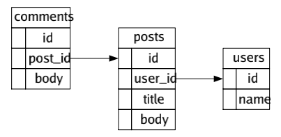

SQLite schema visualizer
========================

[](https://github.com/paulsmith/sqlite-schema-viz/actions/workflows/go.yml)

## Usage

    $ sqlite-schema-viz /path/to/sqlite.db

## Example

```sql
CREATE TABLE users ( id integer, name text );
CREATE TABLE posts ( id integer, user_id integer, title text, body text, foreign key (user_id) references users(id) );
CREATE TABLE comments ( id integer, post_id integer, body text, foreign key (post_id) references posts(id) );
```



## Credits

Credit to [@Screwtapello](https://gitlab.com/Screwtapello) on Gitlab for
[sqlite-schema-diagram](https://gitlab.com/Screwtapello/sqlite-schema-diagram/)
which provides the SQL query that generates the Graphviz DOT output this tool
is based on.
